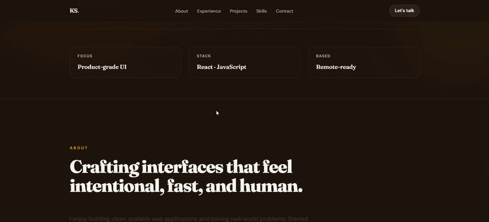
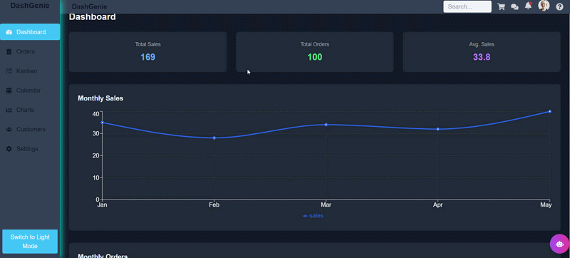
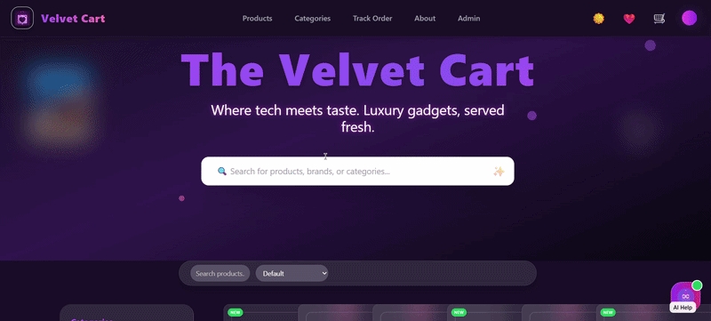

---

## 👋 About Me

I’m **Krishna Sharma**, a Full Stack Developer who builds scalable web applications with a strong focus on **clean UI, performance, and real-world usability**.

I don’t just build features - I build **usable products**.

---

## ⚡ What I Do Best

- 🚀 Build full stack applications from scratch  
- 🎨 Design clean, modern, responsive UI  
- ⚙️ Integrate APIs & real-world business logic  
- 📦 Structure scalable and maintainable code  

---

## 🚀 Portfolio

<table>
<tr>
<td width="60%">

Explore my work — real projects with practical use cases and clean UI execution.

🔗 https://portfolio-pi-eight-epcw8688vr.vercel.app

</td>

<td width="40%">

</td>
</tr>
</table>

---

## 🧩 Tech Stack

---

## 🚀 Featured Work

---

### 💎 DashGenie – Admin Dashboard

<table>
<tr>
<td width="60%">

Modern dashboard for managing workflows, analytics, and tasks.

**Stack:** React • Tailwind • APIs  

**Highlights:**
- Clean UI system  
- Scalable layout  
- Real dashboard structure  

🔗 https://krishnash648.github.io/DashGenie/

</td>

<td width="40%">

</td>
</tr>
</table>

---

### 🛒 Velvet Cart – E-commerce UI

<table>
<tr>
<td width="60%">

Premium e-commerce interface inspired by modern UI systems.

**Stack:** React • Tailwind  

**Highlights:**
- Smooth UI interactions  
- Responsive design  
- Product-first layout  

🔗 https://krishnash648.github.io/the-velvet-cart/

</td>

<td width="40%">

</td>
</tr>
</table>

---

### 🧾 Service Desk App – Ticket System

<table>
<tr>
<td width="60%">

Full-stack ticket management system with role-based control.

**Stack:** React • Firebase  

**Highlights:**
- Role-based access  
- Structured workflows  
- Real-world use case  

🔗 https://service-desk-app-vegu.vercel.app/login

</td>

<td width="40%">

</td>
</tr>
</table>

---

## 🚧 Currently Working On

- Improving backend architecture  
- Building scalable systems  
- Refining UI performance  

---

## 💻 Developer Mindset

- Build → Test → Improve  
- Focus on clarity over complexity  
- Prefer real-world execution over theory  

---

## 📬 Connect With Me

---

✨ Building real-world applications with clean UI and scalable architecture.
